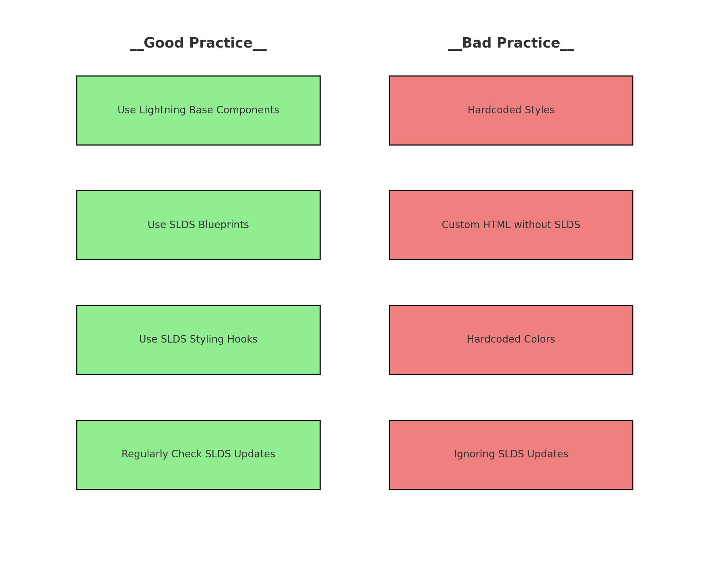

# Error Handling in Lightning Web Components (LWC)

Error handling is a crucial part of any application and should be incorporated from the design phase. In Lightning Web Components, error handling involves both server-side and client-side strategies to manage expected and unexpected errors gracefully. [Check the full example](./Exsamples.js#L1).

### Server-Side Error Handling: 
- Use Apex methods with `try-catch` blocks to handle server-side exceptions and send user-friendly error messages to the client.
- Implement custom exception classes to provide meaningful error responses.

### Client-Side Error Handling:
- Use the `@wire` decorator to handle data fetching from Apex or Lightning Data Service (LDS).
- Capture errors during data provisioning and handling, ensuring any issues are managed and reported correctly.

### Displaying Errors:
- Implement a reusable component to consistently display error messages across various parts of the application.
- Ensure errors are shown in a user-friendly way that provides clear feedback to the user.

# Debugging Lightning Web Components

When developing **Lightning Web Components (LWC)**, it is essential to understand how to debug them effectively. This guide introduces key debugging techniques, both in **production mode** and **debug mode**. Production mode provides minified JavaScript and proxied values, while debug mode offers unminified code, custom formatting, and helpful engine warnings. Debug mode enhances the developer experience by making JavaScript more readable and providing better insights into potential issues.

To illustrate these techniques in practice, let's explore a common debugging scenario with a component called `OrderDetails`.

## Scenario: Debugging `OrderDetails`
[Check the full example](./Exsamples.js#L108)
You’ve built a Lightning Web Component called `OrderDetails` that fetches order details based on an order ID and conditionally displays related order items when the order is marked as **Shipped**. While testing, the order details render correctly, but the order items do not show, even though the order status is **Shipped**. There are no obvious errors in the browser console.

## Debugging the Issue Using Chrome DevTools Inspector

1. **Inspect the DOM:**
   Right-click anywhere on the page where the `OrderDetails` component is displayed and select **Inspect**. This opens Chrome DevTools with the **Elements** tab showing the structure of the HTML.

   - In the **Elements** panel, locate the HTML that corresponds to the order details and order items. You should see a `<lightning-card>` element with the order information displayed.

   - Expand the `<lightning-card>` element and its child elements to check if the section responsible for rendering the order items exists in the DOM.

2. **Check Conditional Rendering in the DOM:**
   In your template, the order items are conditionally rendered using the `showOrderItems` variable. To debug this, check if the part of the template responsible for rendering the order items exists in the DOM.
   
   - Look for the `<template if:true={showOrderItems}>` section in the HTML. If this part of the template is **missing**, it indicates that the `showOrderItems` condition is not being met. This confirms that the order items are not being rendered because `showOrderItems` is `false`.

3. **Use the Console to Verify Component State:**
   To check the value of `showOrderItems` and the data being passed to the component, go to the **Console** tab of DevTools. Type `component` to access the LWC instance for `OrderDetails` and check the values of the key variables:
   
   - `component.order`: Check the status of the order.
   - `component.showOrderItems`: Check if the `showOrderItems` flag is `true`.
   - If `component.showOrderItems` is `false` even when `component.order.Status` is `'Shipped'`, this means the condition in the JavaScript logic isn’t being met properly.

4. **Check Rendered Content in the DOM:**
   If `showOrderItems` is `true`, but you don’t see the order items in the DOM, inspect the `<ul>` element inside the order items section. This is where the list of order items should be rendered.

   - Expand the `<ul>` element in the **Elements** tab. If the list items `<li>` are missing, it could mean that the `orderItems` data is either empty or not rendering properly.
   
   - In the **Console**, check if `component.orderItems` contains the expected data.

5. **Use Element Properties to Debug Styling:**
   If the `<ul>` and its child `<li>` elements are present in the DOM but not visible, inspect their **CSS styles** in the **Elements** panel to ensure that they aren’t being hidden due to styling issues (e.g., `display: none` or `visibility: hidden`).
   
   - Select the `<ul>` or `<li>` elements and check the **Styles** panel to see if there are any rules affecting their visibility.

6. **Manually Toggle Component State:**
   In the **Console**, you can manually change the state of the component to see if it correctly triggers the DOM update. Try setting `component.showOrderItems` to `true` to force the display of the order items.
   
   - After setting this, inspect the DOM again in the **Elements** tab to see if the order items section is now being rendered. If the order items are displayed, this confirms that the rendering logic is working but wasn’t triggered initially.
     
[Read the full guide on the official website](https://developer.salesforce.com/blogs/2019/02/debug-your-lightning-web-components)


# Best Practices for Styling Aura and LWC with SLDS


---

1. **<span style="color:green">Lightning Base Components</span>**
   - Use built-in components for accessibility and SLDS compliance.
   - **Recommended Approach**:  
     ```html
     <lightning-button label="Submit" variant="brand"></lightning-button>
     ```
   - **Avoid This**:  
     Using hardcoded styles instead of SLDS-compliant components.  
     ```html
     <button style="background-color: #0070d2; color: white;">Submit</button>
     ```

---

2. **<span style="color:green">SLDS Blueprints</span>**
   - Provides flexible, customizable components while ensuring SLDS standards.
   - **Preferred Method**:  
     ```html
     <div class="slds-button slds-button_brand">Submit</div>
     ```
   - **What to Avoid**:  
     Customizing components without using SLDS classes, which can lead to inconsistency in design and accessibility.  
     ```html
     <div class="custom-button">Submit</div>
     ```

---

3. **<span style="color:green">SLDS Styling Hooks</span>**
   - Hooks provide access to variables controlling key styles like typography, spacing, and colors.
   - **Best Practice**:  
     ```css
     .my-custom-container {
       background-color: var(--slds-g-color-surface-container-1);
     }
     ```
   - **Not Recommended**:  
     Using hardcoded color values that won’t update with SLDS changes.  
     ```css
     .my-custom-container {
       background-color: #f3f3f3;
     }
     ```

---

4. **<span style="color:green">Check SLDS Updates</span>**
   - Always ensure you're using the latest Salesforce tools like [Salesforce Validator 2.0](https://marketplace.visualstudio.com/items?itemName=salesforce.salesforce-vscode-slds).
   - **Best Approach**:  
     Regularly review and replace deprecated hooks with supported global hooks.
     ```css
     .my-custom-container {
       background-color: var(--slds-g-color-surface-container-1, var(--lwc-cardColorBackground));
     }
     ```
   - **Outdated Practice**:  
     Continuing to use deprecated properties without updating them for SLDS 2 compatibility.  
     ```css
     .my-custom-container {
       background-color: var(--lwc-cardColorBackground);
     }
     ```

---

## Additional Resources

- [Create LWC Components with SLDS](https://developer.salesforce.com/docs/platform/lwc/guide/create-components-css-slds.html)
- [SLDS Best Practices](https://www.lightningdesignsystem.com/dev-guidelines/best-practices/)

